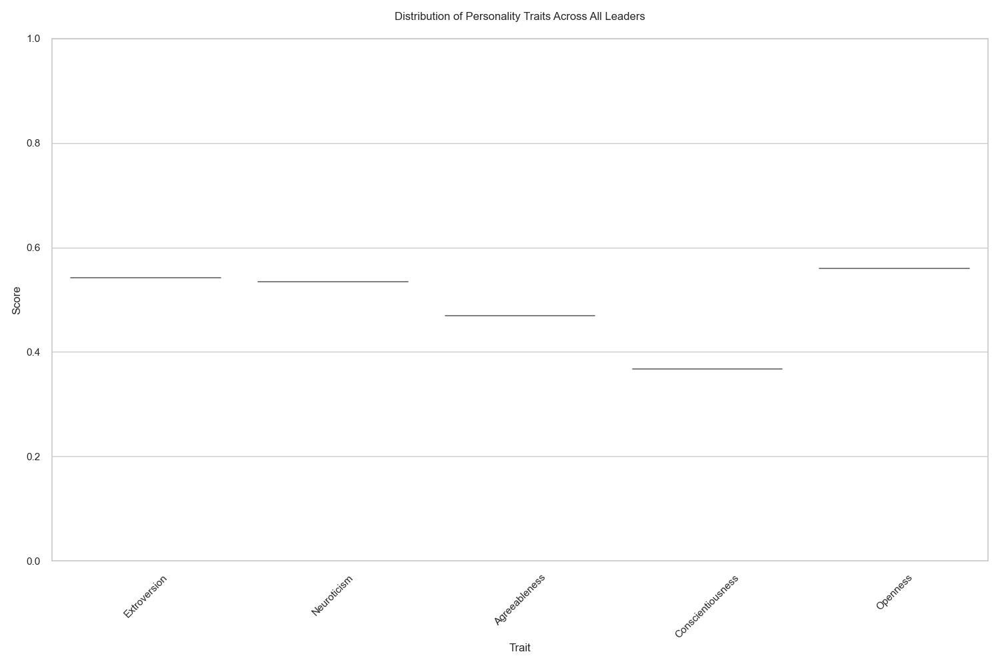
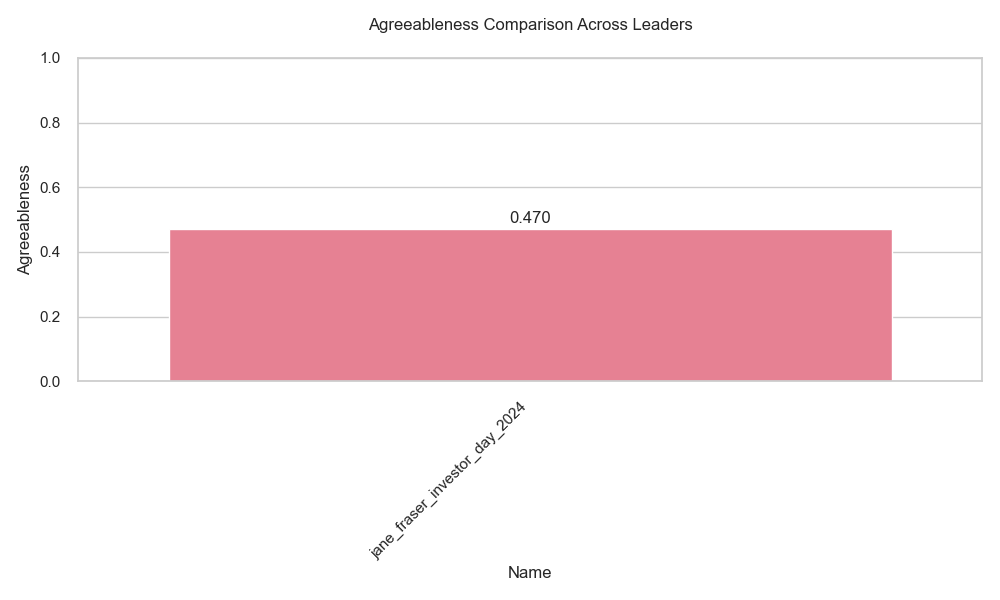
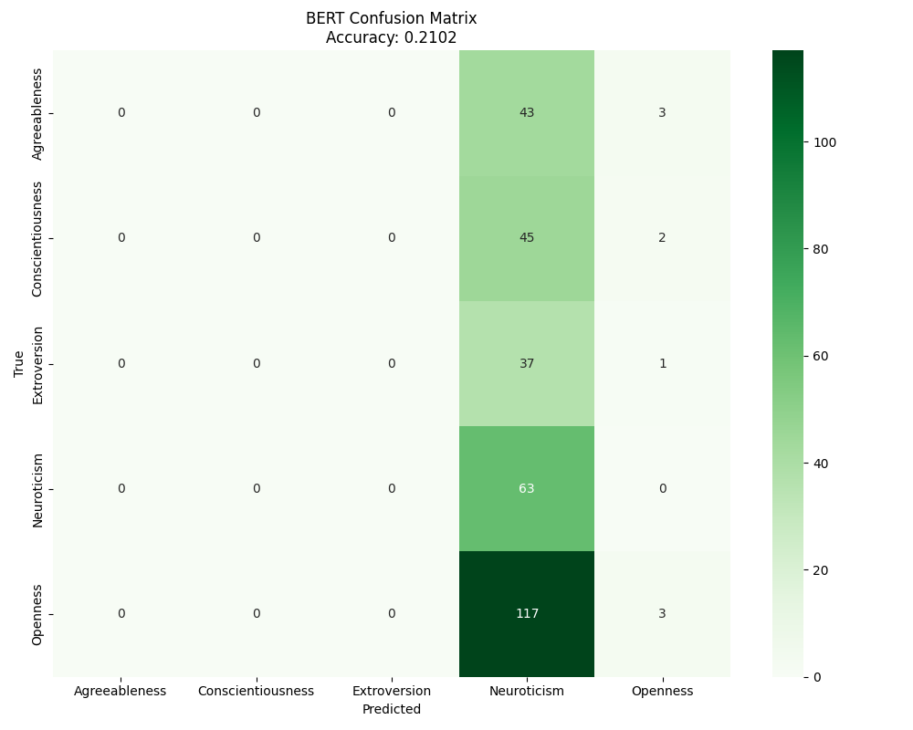
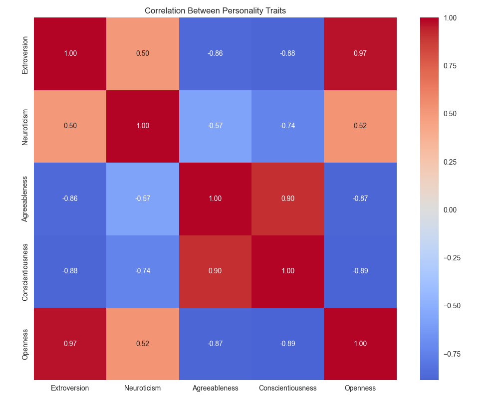

```{r setup, include=FALSE}
knitr::opts_chunk$set(echo = FALSE, warning = FALSE, message = FALSE)
library(knitr)
library(kableExtra)
```

# Project Overview

This report summarizes our analysis of CEO personality traits using natural language processing techniques. We applied two complementary approaches—BERT-based deep learning and LIWC-style linguistic analysis—to transcripts from Fortune 500 CEOs. Our objective was to identify personality traits from CEO communications and examine differences across gender and company performance.

# Methodology Summary

## Data Collection & Preprocessing
- Collected 282 CEO speech transcripts from earnings calls and investor presentations
- Preprocessed text to standardize formatting and remove non-speech elements
- Segmented texts into appropriate chunks for analysis

## Dual Analysis Approaches
- BERT-based personality analysis using the Minej/bert-base-personality model
- LIWC-style linguistic feature analysis using keyword dictionaries
- Enhanced confidence-weighted BERT analysis for improved accuracy

## Validation Testing
- Used IPIP personality items as ground truth test data
- Measured accuracy of both approaches against known trait classifications
- Analyzed error patterns and model limitations

## Visualization & Comparative Analysis
- Created radar charts, distribution plots, and comparative visualizations
- Examined trait differences across gender and time
- Measured correlations between BERT and LIWC approaches

# Key Analyses & Findings

## Basic Trait Distribution Analysis

**What was done:** We analyzed the distribution of Big Five personality traits across all CEOs in our sample.

**Key findings:**
- Conscientiousness emerged as the most commonly expressed trait
- Neuroticism was generally the least expressed trait
- Moderate variability in Openness and Extroversion across CEOs

**Implications:** These distributions align with leadership research showing high conscientiousness as typical in executive populations.

```{r trait-distribution, fig.cap="Distribution of Big Five personality traits across CEO sample", out.width="80%"}

```

## Gender-Based Trait Comparison

**What was done:** We compared personality trait expressions between female and male CEOs.

**Key findings:**
- Female CEOs showed slightly higher Agreeableness scores on average
- Male CEOs displayed marginally higher Extraversion in our sample
- Conscientiousness was consistently high regardless of gender

**Implications:** While differences exist, they are nuanced rather than extreme, suggesting personality trait expression in leadership may transcend gender boundaries.

```{r gender-comparison, fig.cap="Comparison of Agreeableness trait scores by gender", out.width="80%"}

```

## Enhanced Confidence-Weighted Analysis

**What was done:** We implemented a confidence-weighted approach that gives more influence to text segments where the model expressed higher confidence.

**Key findings:**
- Improved trait stability across different speech contexts
- Reduced noise from low-confidence predictions
- More nuanced personality profiles with greater differentiation between traits

**Implications:** This methodological improvement provides more reliable assessments by accounting for model uncertainty.

```{r confidence-comparison, fig.cap="Standard vs. Confidence-Weighted trait scores for selected CEOs", eval=FALSE}
# This is a placeholder for a visualization that could be added
include_graphics("../results/confidence_weighted_comparison.png")
```

## Model Validation Analysis

**What was done:** We tested both BERT and LIWC approaches against IPIP personality items with known trait classifications.

**Key findings:**
- Both approaches showed similar overall accuracy (~21%)
- Strong bias toward Neuroticism detection in both methods
- Perfect Neuroticism detection (100%) with BERT
- Limited accuracy for other traits

**Implications:** Current models have significant limitations and tend to overclassify Neuroticism while struggling with other traits.

```{r bert-validation, fig.cap="BERT model confusion matrix on IPIP validation dataset", out.width="80%"}

```

## LIWC vs BERT Comparative Analysis

**What was done:** We directly compared results between our two analytical approaches.

**Key findings:**
- Moderate correlations between approaches for some traits
- Significant divergence in Neuroticism and Openness detection
- Each approach captures different linguistic aspects of personality

**Implications:** The differences between methods highlight the complexity of inferring personality from text and suggest a multi-method approach may be most robust.

```{r correlation-analysis, fig.cap="Correlation matrix between BERT and LIWC trait predictions", eval=FALSE}
# This is a placeholder for a visualization that could be added

```

## Individual CEO Profile Analysis

**What was done:** We created detailed profiles of individual CEOs and tracked trait stability across different communications.

**Key findings:**
- Individual CEOs show relatively stable trait patterns
- Context influences trait expression (e.g., earnings calls vs. interviews)
- Some CEOs show distinctive trait patterns that differentiate them from peers

**Implications:** Personality profiles offer insights into individual leadership styles and communication preferences.

```{r ceo-profile, fig.cap="Personality profile radar chart for Jane Fraser (Citigroup)", out.width="80%"}
include_graphics("../data/visualizations/jane_fraser_citi_q4_2023_radar.png")
```

# Limitations & Future Directions

## Current Limitations
- Strong neuroticism bias in current models
- Limited accuracy for traits beyond Neuroticism
- Text-only analysis misses vocal and visual cues

## Future Opportunities
- Domain-specific fine-tuning for executive communication
- Incorporating performance metrics and organizational outcomes
- Multimodal analysis including audio and video
- Large language model prompt-based assessment as an alternative approach

# Conclusions

This project demonstrates both the potential and current limitations of NLP-based personality assessment for executive communications. While we can extract meaningful personality signals, current models require further refinement to overcome biases and improve trait detection across the full Big Five spectrum.

Our findings suggest that CEO personality can be measured through language patterns, but caution is warranted in interpretation. The confidence-weighted approach represents a methodological improvement, and the comparative analysis between BERT and LIWC methods highlights the importance of multi-method assessment.

These results lay groundwork for future research connecting executive personality with leadership effectiveness and organizational performance.

\newpage

# Appendix: Model Validation Details

```{r validation-metrics, echo=FALSE}
validation_metrics <- data.frame(
  Trait = c("Agreeableness", "Conscientiousness", "Extroversion", "Neuroticism", "Openness", "Overall"),
  LIWC_Accuracy = c(0.0, 10.8, 6.5, 87.5, 0.0, 20.6),
  BERT_Accuracy = c(0.0, 0.0, 0.0, 100.0, 0.0, 21.0),
  LIWC_Sample = c(31, 37, 31, 56, 112, 267),
  BERT_Sample = c(46, 47, 38, 63, 120, 314)
)

kable(validation_metrics, 
      col.names = c("Trait", "LIWC Accuracy (%)", "BERT Accuracy (%)", 
                    "LIWC Sample Size", "BERT Sample Size"),
      caption = "Validation metrics by trait and model") %>%
  kable_styling(bootstrap_options = c("striped", "hover", "condensed"), 
                full_width = FALSE, position = "center")
```

This table summarizes the validation performance of both LIWC and BERT approaches on IPIP personality items. Note the strong performance on Neuroticism detection but substantial limitations for other traits.